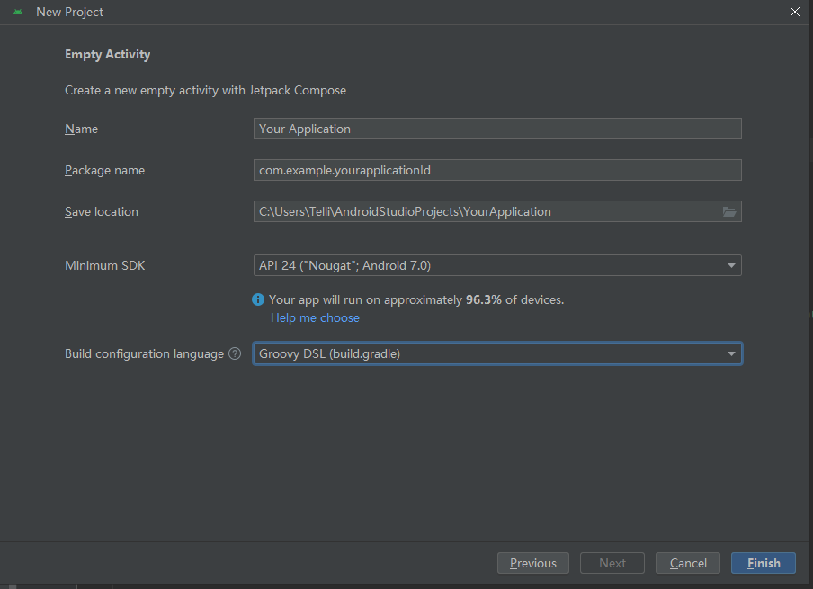
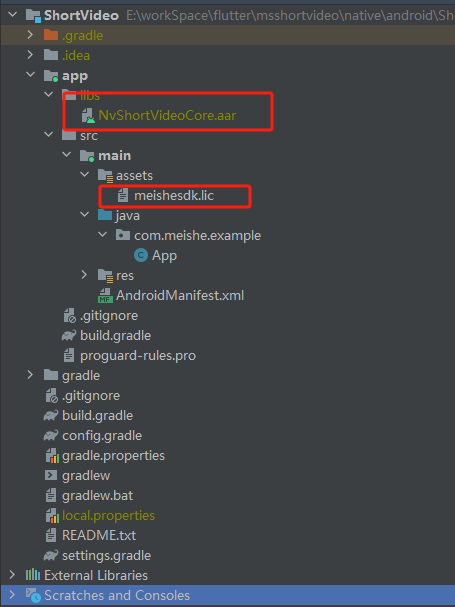

<!-- MEISHE_AGENT_DOC_ENHANCED: v1 -->
# 美摄短视频模块接入指引

<!-- BEGIN MEISHE_AGENT_QUICK_INDEX -->
> **Agent 快速索引**
> - **Doc ID**: `native-quickstart-doc-ch-quickstart-android-ch`
> - **语言轨道**: `native`
> - **平台**: `android`
> - **标签**: `quickstart, integration, native-android, aar, gradle, manifest, permission, license, server-config`
> - **图片数**: `2`
> - **用法**: 先按标签定位章节，再读取相邻步骤、配置表和图片解析；不要跳过本页内的注意事项。
<!-- END MEISHE_AGENT_QUICK_INDEX -->


## 开发环境要求

* Android studio 2023.12+。
* JDK 11， TargetSdkVersion 34

> ⚠️ **Note:** 需要在真机上运行，模拟器暂不支持
## 升级短视频注意事项
### 1.5.2版本升级:
* 一键成片做了全新升级，详细代码参考demo，可以在支持群联系服务端开发同事协助升级服务端接口，所以使用一键成片功能，一定要联系我们的服务端同事协助升级。有任何问题都可以联系我们
### 1.5.1版本升级:
* 修复了一些已知问题
### 1.5.0版本升级:
* **此版本更新较大，上线之前一定要进行回归测试，尤其是配置项的变化**
### 1.4.0版本升级:
* 安卓的一键成片没有升级，所以安卓的接口没有变化，不需要改动。这一点要和ios区分开。有需要对接一键成片的，请在群里联系我们的相关同事
### 1.3.0版本升级:
* **1.编辑**UI**更新：调整下一步，保存位置为底部菜单。**
* **2.新增导出美摄sdk配置项；支持的配置参数详见：[美摄sdk生成配置项参数](https://www.meishesdk.com/android/doc_ch/html/content/classcom_1_1meicam_1_1sdk_1_1NvsStreamingContext.html#COMPILE_CONFIGURATIONS)**
```java
private void testCompileConfig() {
        mVideoConfig = NvModuleManager.get().getConfig();
        if (null == mVideoConfig) {
            mVideoConfig = new NvVideoConfig();
        }
        NvCompileConfig compileConfig = mVideoConfig.getCompileConfig();
        Map<String, Object> compileMap = new HashMap<>();
        compileMap.put(VIDEO_ENCODEC_NAME, "hevc");
        compileConfig.setConfigure(compileMap);
//        compileConfig.setFps(30);
        mVideoConfig.setCompileConfig(compileConfig);
    }
```
* 3.新增导出时支持多张图片保存，支持获取发布数据：**视频路径，图片路径，musicInfo数据**。
```java
    NvPublishInfo publishInfo = NvModuleManager.get().getPublishInfo();
        // 单张图片路径
        String coverPath = publishInfo.getCoverPath();
        // 音乐信息
        NvMusicInfo musicInfo = publishInfo.getMusicInfo();
        // 多张图片路径集合
        List<String> imagesPath = publishInfo.getImagesPath();
        // 视频路径
        String videoPath = publishInfo.getVideoPath();
```
* 4.新增Api，用于获取是否支持多张图片保存。
```java
    boolean onlyHaveMultipleImage = NvModuleManager.get().isOnlyHaveMultipleImage();
```
* **5.新增拍摄配置项：默认选择项**拍照，视频，快拍**。**
```java
    private void testCaptureConfig() {
        mVideoConfig = NvModuleManager.get().getConfig();
        if (null == mVideoConfig) {
            mVideoConfig = new NvVideoConfig();
        }
        NvCaptureConfig captureConfig = mVideoConfig.getCaptureConfig();
        // NvCaptureBottomMenuItem.image
        // NvCaptureBottomMenuItem.video
        // NvCaptureBottomMenuItem.smart
        captureConfig.setDefaultBottomMenuSelectItem(NvCaptureConfig.NvCaptureBottomMenuItem.video);
        mVideoConfig.setCaptureConfig(captureConfig);
    }
``` 
* **6.新增拍摄，编辑添加支持菜单文字修改阴影配置。**
```java
    private void testShadowLayer() {
        mVideoConfig = NvModuleManager.get().getConfig();
        if (null == mVideoConfig) {
            mVideoConfig = new NvVideoConfig();
        }
        // 设置阴影颜色
        mVideoConfig.setShadowColor("#FC3E5A");
        // 设置阴影偏移量
        NvShadowOffsetConfig nvShadowOffsetConfig = new NvShadowOffsetConfig(0, 1);
        mVideoConfig.setShadowOffset(nvShadowOffsetConfig);
    }
```
* 7.fix 特定环境下出现的拍摄滤镜底部弹窗出现的UI错乱问题。
* 8.优化 检查相册中数据是否真实存在，如果不存在则提示视频｜照片不存在
* 9.优化 编辑滑动底部进度条时，隐藏所有操作菜单项。 
* 10.Android适配16k。
* **11.接口更新： **NvModuleManager.java** 统一了导出数据的获取接口。**
```java
    // public interface OnCompileImageListener {
    //     void onCompileFinished(boolean isSuccess, String path);
    // }
   public interface OnCompileImageListener {
        void onCompileFinished(boolean isSuccess);
    }
    // path 统一从NvPublishInfo获取
    NvModuleManager.get().getPublishInfo();
```

### 1.2.9版本升级：
* **1.2.9版本新增了导出带水印的视频和图片，如果用户配置了水印，那么在导出时视频和封面是带水印的。**
### 1.2.8版本升级：
* **1.2.7版本进入拍摄、编辑、合拍时需要先下载资源，新版本不会阻塞进入拍摄、编辑、合拍，会在进入的时候后台默默下载。同时也提供了接口用户也可以主动调用，如果用户不主动调用shortvideo将会默认调用。**
```java
public void downloadPrefabricatedMaterial(Activity activity, OnAssetsRequestListener onAssetsRequestListener)
```
### 1.2.7版本升级：
* **原生工程直接替换AAR库**
1.2.7版本在进入拍摄、合拍、剪辑功能时，在原有接口基础上增加回调，用来监听内置资源下载完成
```NvModuleManager.java
//拍摄入口
- public void openCapture(Activity activity, NvVideoConfig videoConfig, NvMusicInfo musicInfo, OnAssetsRequestListener onAssetsRequestListener);
//合拍入口
- public void startDualCapture(Activity activity, NvVideoConfig videoConfig, OnAssetsRequestListener onAssetsRequestListener);
//剪辑入口
- public void openEdit(Activity activity, NvVideoConfig videoConfig, OnAssetsRequestListener onAssetsRequestListener);
```


## 支持媒体格式

详见：[美摄sdk产品概述](https://www.meishesdk.com/android/doc_ch/html/content/Introduction_8md.html)

# 工程构建

1. 新建Android 工程

   运行File—new—New Project， 进行如下设置后，点击finish

   
> **图片解析：** `path=../assets/android_image/image-20240516153236811.png`，`size=904x655`，用途：原生 Android 工程配置或资源位置参考。

2. 将aar包到libs目录下

   将NvShortVideoCore. aar包，放到libs目录下

3. 将meishesdk.lic 放asset目录下

   
> **图片解析：** `path=../assets/android_image/image-20240516185729759.png`，`size=455x607`，用途：原生 Android 工程配置或资源位置参考。

   > **meishesdk.lic** 是通过美摄官网申请的license，该license和appid绑定
   >
   > 在[美摄官网](https://www.meishesdk.com)注册用户后，创建应用，配置appid，由美摄商务同事开通授权后，可在应用信息中下载授权文件。
   >
   > SDK授权和App的appld绑定。未授权时，SDK全功能不再检查授权，都可以使用，绘制的画面会带MEISHE水印。


4. **创建依赖项**

   ```xml
   implementation rootProject.ext.dependencies.extMutilDex
   implementation rootProject.ext.dependencies.extAndroidXDesign
   implementation rootProject.ext.dependencies.extAppcompat
   implementation rootProject.ext.dependencies.extAppcompatRecycler
   implementation rootProject.ext.dependencies.extConstraintLayout
   //Gson
   implementation rootProject.ext.dependencies.extGoogleGson
   implementation rootProject.ext.dependencies.extWebpdecoder
   //Utils
   implementation rootProject.ext.dependencies.utils
   //BRVAH
   implementation rootProject.ext.dependencies.brvah
   // glide 4.6.1~4.9.0 (exclude broken version 4.6.0, 4.7.0)
   implementation rootProject.ext.dependencies.extBumptechGlide
   annotationProcessor rootProject.ext.dependencies.extGlideAnnotation
   //permission
   implementation rootProject.ext.dependencies.permissionx
   //Smart refresh
   implementation rootProject.ext.dependencies.smartRefreshLayout
   implementation rootProject.ext.dependencies.smartRefreshHeader
   //room
   implementation rootProject.ext.dependencies.room
   annotationProcessor rootProject.ext.dependencies.roomComplier
   //okhttp
   implementation rootProject.ext.dependencies.extOkhttp
   //exoplayer
   implementation rootProject.ext.dependencies.exoplayer
   //eventBus
   implementation rootProject.ext.dependencies.eventBus
   ```

   依赖项见 config.gradle 配置

## 系统权限说明

<!-- BEGIN MEISHE_AGENT_SECTION_HINT -->
> **Agent 索引提示：** 本节标签 `permission`。接入执行时优先核对本节步骤、配置项、路径和权限要求。
<!-- END MEISHE_AGENT_SECTION_HINT -->


App 需要在以下权限，否则将无法使用短视频模块。

```xml
 <uses-permission android:name="android.permission.SYSTEM_ALERT_WINDOW" />
    <uses-permission android:name="android.permission.CAMERA" />
    <uses-permission android:name="android.permission.RECORD_AUDIO" />
    <uses-permission android:name="android.permission.WRITE_EXTERNAL_STORAGE" />
    <uses-permission android:name="android.permission.READ_EXTERNAL_STORAGE" /> <!-- <uses-permission android:name="android.permission.MOUNT_UNMOUNT_FILESYSTEMS" /> -->
    <uses-permission android:name="android.permission.INTERNET" />
    <uses-permission android:name="android.permission.ACCESS_NETWORK_STATE" />
    <uses-permission android:name="android.permission.VIBRATE" />
    <uses-permission android:name="android.permission.WAKE_LOCK" />
    <uses-permission android:name="android.permission.ACCESS_NOTIFICATION_POLICY" /> <!-- <uses-permission android:name="android.permission.INTERNET" /> -->
    <uses-permission android:name="android.permission.ACCESS_WIFI_STATE" />
    <uses-permission android:name="android.permission.CHANGE_WIFI_STATE" /> <!-- 用于进行网络定位 -->
    <uses-permission android:name="android.permission.ACCESS_COARSE_LOCATION" /> <!-- 用于访问GPS定位 -->
    <uses-permission android:name="android.permission.ACCESS_FINE_LOCATION" /> <!-- 用于读取手机当前的状态 -->
    <uses-permission android:name="android.permission.REQUEST_INSTALL_PACKAGES" />
    <uses-permission android:name="android.permission.EXPAND_STATUS_BAR" />
```

## 美摄SDK授权

<!-- BEGIN MEISHE_AGENT_SECTION_HINT -->
> **Agent 索引提示：** 本节标签 `license`。接入执行时优先核对本节步骤、配置项、路径和权限要求。
<!-- END MEISHE_AGENT_SECTION_HINT -->


在[美摄官网](https://www.meishesdk.com)注册用户后，创建应用，配置appid，由美摄商务同事开通授权后，可在应用信息中下载授权文件。

**需要将授权.lic文件添加到App工程的asset目录下**

```java
执行NvModuleManager.initSdk("assets:/meishesdk.lic") 方法，进行sdk授权
```


> SDK授权和App的appld绑定。未授权时，SDK全功能不再检查授权，都可以使用，绘制的画面会带MEISHE水印。

## 网络接口配置

<!-- BEGIN MEISHE_AGENT_SECTION_HINT -->
> **Agent 索引提示：** 本节标签 `server-config`。接入执行时优先核对本节步骤、配置项、路径和权限要求。
<!-- END MEISHE_AGENT_SECTION_HINT -->


短视频模块用到的滤镜、贴纸、音乐等文件均通过网络接口获取。通过设置host的形式配置

定义在NvsServerClient.java 文件中

```javascript
/*! \if ENGLISH
     *
     *  \brief Init net host
     *  \param application The application
     *  \param host the host
     *  \param complatetionHandler
     *  \else
     *
     *  \brief 初始化网路
     *  \param application app
     *  \param host host
     *  \endif
     */
    public void initConfig(Application application, String host)
```

在EngineNetApi.java 里，定义了各种功能接口，可以修改以下变量，进行功能接口配置

```java
/**
     * 根据分类获取素材列表
     * Get a list of materials by category
     */
    public static String NV_ASSET_REQUEST_URL = "materialcenter/mall/custom/listAllAssemblyMaterial";
    /**
     * 根据素材类型获取素材分类列表
     * Gets a classified list of materials based on their type
     */
    public static String NV_ASSET_CATEGORY_URL = "materialcenter/appSdkApi/listTypeAndCategory";
    /**
     * 获取字体列表
     * Get font list
     * materialcenter/appSdkApi/material/listAll
     */
    public static String NV_ASSET_FONT_URL = "materialcenter/listFont";
    /**
     * 获取音乐列表
     * Get music list
     */
    public static String NV_ASSET_MUSICIANS_URL = "materialcenter/appSdkApi/listMusic";
    /**
     * 把素材的id作为参数传入，获取到素材下载的链接
     * Pass in the id of the material as a parameter to get the link to the material download
     */
    public static String NV_ASSET_DOWNLOAD_URL = "materialcenter/mall/custom/materialInteraction";
    /**
     * 获取预置素材
     * Get the Prefabricated material for the project
     */
    public static String NV_ASSET_PREFABRICATED_URL = "materialcenter/beautyAssets/latest";
    /**
     * 一键成片
     * AutoCut
     */
    public static String NV_ASSET_AUTOCUT_URL = "materialcenter/recommend/listTemplate";
    /**
     * 获取模版的标签分类
     * Gets the label classification of the template
     * materialcenter/appSdkApi/listTemplateTag
     */
    public static String NV_ASSET_TAG_URL = "materialcenter/listTemplateTag";
    /** 公共参数
      *Default parameters
      */
    NvsServerClient.MallInfo.CLIENT_ID = NV_ClientId;
    NvsServerClient.MallInfo.CLIENT_SECRET = NV_ClientSecret;
    NvsServerClient.MallInfo.ASSEMBLY_ID = NV_AssemblyId;
```


## 预制素材

<!-- BEGIN MEISHE_AGENT_SECTION_HINT -->
> **Agent 索引提示：** 本节标签 `prefabricated-material`。接入执行时优先核对本节步骤、配置项、路径和权限要求。
<!-- END MEISHE_AGENT_SECTION_HINT -->


短视频模块依赖的素材包可根据需要选择。预制素材详见：[短视频模块预制素材](./PrefabricatedMaterial_ch.html)

## 短视频模块主要方法

模块方法主要定义在NvModuleManager.java 文件中

###  初始化sdk

``` java
 /** \if ENGLISH
     *
     *  \brief InitSdk
     *  @param licPath the licPath
     *  \else
     *
     *  \brief 美摄SDK授权
     *  @param licPath 授权文件
     *  \endif
     */
    public void initSdk(String licPath)
```

### 视频录制

```javascript
/** \if ENGLISH
     *
     *  \brief Open capture
     *  @param activity the activity
     *  @param videoConfig the config information
     *  @param musicInfo the config music information
     *  \else
     *
     *  \brief 打开拍摄
     *  @param activity 授权文件
     *  @param videoConfig 配置信息
     *  @param musicInfo 音乐信息
     *  \endif
     */
    public void openCapture(Activity activity, NvVideoConfig videoConfig, NvMusicInfo musicInfo)
```

### 合拍

<!-- BEGIN MEISHE_AGENT_SECTION_HINT -->
> **Agent 索引提示：** 本节标签 `function-config`。接入执行时优先核对本节步骤、配置项、路径和权限要求。
<!-- END MEISHE_AGENT_SECTION_HINT -->


```javascript
/** \if ENGLISH
     *
     *  \brief Open dual capture.Open the album, and jump to the dual capture activity.
     *  @param activity the activity
     *  @param videoConfig the config information
     *  \else
     *
     *  \brief 打开合拍 即跳转相册，进入合拍页面
     *  @param activity activity
     *  @param videoConfig 配置信息
     *  \endif
     */
    public void openDualCapture(Activity activity, NvVideoConfig videoConfig)

 /** \if ENGLISH
     *
     *  \brief Open dual capture.Open the album, and jump to the dual capture activity.
     *  @param activity the activity.
     * If you need to configure the export path, you need to call this method
     *  @param videoConfig the config information
     *  @param videoPath The video path prepared for co production must be a local path.
     *  \else
     *
     *  \brief 打开合 拍即跳转相册，进入合拍页面
     *  如果需要配置导出路径，需要调用此方法
     *  @param activity 授权文件
     *  @param videoConfig 配置信息
     *  @param videoPath 准备合拍的视频路径，必须是本地路径
     *  \endif
     */
    public void openDualCapture(Activity activity, NvVideoConfig videoConfig, String videoPath)
```


### 视频编辑

<!-- BEGIN MEISHE_AGENT_SECTION_HINT -->
> **Agent 索引提示：** 本节标签 `function-config`。接入执行时优先核对本节步骤、配置项、路径和权限要求。
<!-- END MEISHE_AGENT_SECTION_HINT -->


```javascript
/** \if ENGLISH
     *
     *  \brief Open edit
     *  @param activity the activity
     *  @param videoConfig the config information
     *  \else
     *
     *  \brief 打开编辑
     *  @param activity activity
     *  @param videoConfig 配置信息
     *  \endif
     */
public void openEdit(Activity activity, NvVideoConfig videoConfig)
```

### 跳转发布页回调

<!-- BEGIN MEISHE_AGENT_SECTION_HINT -->
> **Agent 索引提示：** 本节标签 `function-config`。接入执行时优先核对本节步骤、配置项、路径和权限要求。
<!-- END MEISHE_AGENT_SECTION_HINT -->


```javascript
public interface NvModuleManagerCallback {

    /** \if ENGLISH
     *
     *  \brief Publish with info callback
     *  @param activity The activity
     *  @param needSaveDraft Need save draft or not.
     *  @param needSaveCover Need save cover or not.
     *  @param needSaveVideo Need save video or not.
     *  \else
     *
     *  \brief 跳转发布页面回调
     *  @param activity The activity
     *  @param needSaveDraft 是否要保存草稿
     *  @param needSaveCover 是否要保存封面
     *  @param needSaveVideo 是否要保存视频
     *  @param videoPath 视频地址
     *  \endif
     */
    void publishWithInfo(Activity activity, boolean needSaveDraft, boolean needSaveCover, boolean needSaveVideo, String videoPath)
```

### 编辑封面

<!-- BEGIN MEISHE_AGENT_SECTION_HINT -->
> **Agent 索引提示：** 本节标签 `function-config`。接入执行时优先核对本节步骤、配置项、路径和权限要求。
<!-- END MEISHE_AGENT_SECTION_HINT -->


```javascript
/** if ENGLISH
     *
     *  \brief EditCover
     *  @param activity the from activity
     *  @param overPoint Last editing time for cover page
     *  @param requestCode The request code
     *  \else
     *
     *  \brief 编辑封面
     *  @param  activity 编辑封面的发起页面
     *  @param  overPoint 上一次编辑封面的时间点
     *  @param  requestCode 请求code
     *  \endif
     */
    public static void editCover(Activity activity, long overPoint, int requestCode)

    //封面编辑不会生成Bitmap，封面的选择时间点，会在onActivityResult方法回调里返回， key是“coverPoint”
    public static final String INTENT_KEY_COVER_POINT = "coverPoint";

    //可以通过CaptureAndEditUtil.java中的方法获取bitmap

     /** if ENGLISH
     *
     *  \brief Get image from timeline
     *  @param overPoint The cover point
     *  \else
     *
     *  \brief 获取时间线上某一帧图片的bitmap
     *  @param  overPoint 选择封面的时间点
     *  \endif
     */
    public static Bitmap getImageFromTime(long overPoint)
```

> 如果需要保存封面，见保存封面接口

### 保存草稿

<!-- BEGIN MEISHE_AGENT_SECTION_HINT -->
> **Agent 索引提示：** 本节标签 `function-config`。接入执行时优先核对本节步骤、配置项、路径和权限要求。
<!-- END MEISHE_AGENT_SECTION_HINT -->


```javascript
 /** \if ENGLISH
     *
     *  \brief Save draft
     *  @param videoDesc The draft description
     *  @param coverPoint The cover point
     *  @param callBack The draft save callback
     *  \else
     *
     *  \brief 保存草稿
     *  @param videoDesc 草稿描述
     *  @param coverPoint 草稿封面
     *  @param callBack 保存草稿回调
     *  \endif
     */
    public void saveDraft(String videoDesc, long coverPoint, DraftManager.DraftSaveCallBack callBack)
```

### 合成视频

```javascript
/** if ENGLISH
     *
     *  \brief Save video to album
     *  @param callback The on compile video listener
     *  \else
     *
     *  \brief 保存视频到相册
     *  @param  callback 保存视频回调
     *  \endif
     */
    public static void saveVideoToAlbum(OnCompileVideoListener callback)
```

### 视频合成回调

```javascript
public interface OnCompileVideoListener {
        /**! \if ENGLISH
         *
         *  \brief compile video progress callback
         *  \@param timeline  the current timeline
         *  \@param progress  the current progress
         *  \else
         *
         *  \brief 合成视频进度回调
         *  \@param timeline 当前的时间线
         *  \@param progress 当前的进度
         *  \endif
         */
        void compileProgress(NvsTimeline timeline,int progress);

        /**! \if ENGLISH
         *
         *  \brief compile video finished callback
         *  \@param timeline  the current timeline
         *  \else
         *
         *  \brief 合成视频完成回调
         *  \@param timeline 当前的时间线
         *  \endif
         */
        void compileFinished(NvsTimeline timeline);

        /**! \if ENGLISH
         *
         *  \brief compile video failed callback
         *  \@param timeline  the current timeline
         *  \else
         *
         *  \brief 合成视频失败回调
         *  \@param timeline 当前的时间线
         *  \endif
         */
        void compileFailed(NvsTimeline timeline);


         /**! \if ENGLISH
         *
         *  \brief compile video completed callback
         *  \@param timeline  the current timeline
         *  \@param compileVideoPath  the compile video path
         *  \@param isCanceled  The compile is canceled or not
         *  \else
         *
         *  \brief 合成视频完成回调
         *  \@param timeline 当前的时间线
         *  \@param compileVideoPath 保存路径
         *  \@param isCanceled 合成是否被取消
         *  \endif
         */
        void compileCompleted(NvsTimeline nvsTimeline, String compileVideoPath, boolean isCanceled);

        /**! \if ENGLISH
         *
         *  \brief compile video cancel callback
         *  \else
         *
         *  \brief 合成视频被取消回调
         *  \endif
         */
        void compileVideoCancel();


        /**! \if ENGLISH
         *
         *  \brief compile video completed callback
         *  \@param isHardwareEncoder Is hardware encoder or not
         *  \@param errorType The error type
         *  \@param stringInfo The error string info
         *  \@param flags the  flags
         *  \else
         *
         *  \brief 合成视频完成回调
         *  \@param isHardwareEncoder 是否是硬件错误
         *  \@param errorType 错误类型
         *  \@param stringInfo 提示信息
         *  \@param flags the  flags
         *  \endif
         */
        void onCompileCompleted(boolean isHardwareEncoder, int errorType, String stringInfo, int flags);
    }
```

### 保存封面图片

```javascript
/** if ENGLISH
     *
     *  \brief Save cover
     *  @param  coverDir the cover file dir.
     *  @param  coverFileName the cover file name.If empty, it is a timestamp.
     *  @param  coverTime the coverTime
     *   @param  needSaveToAlbum Need Save To Album or not
     *   @param  callBack the on cover saved callback for update ui
     *  @return the boolean Did you successfully execute the save draft
     *  \else
     *
     *  \brief 保存封面
     *  @param  coverDir 封面文件夹路径
     *  @param  coverFileName 封面文件明显,如果为空，则是时间戳
     *  @param  coverTime 封面时间点
     *  @param  needSaveToAlbum 是否需要保存封面
     *  @param  callBack 保存草稿回调，用于更新UI
     *  @return the boolean 是否执行保存草稿成功
     *  \endif
     */
    public boolean saveCover(String coverDir, String coverFileName, long coverTime, boolean needSaveToAlbum, OnCoverSavedCallBack callBack)
```

### 退出短视频模块

视频发布页退出时调用

```javascript
 /** \if ENGLISH
     *
     *  \brief Finish publish
     *  @param activity The activity
     *  @param toActivityClassName The next activity classname you want to
     *  \else
     *
     *  \brief 退出发布页
     *  @param activity 当前页面
     *  @param toActivityClassName 要去的页面的类名
     *  \endif
     */
    public void finishPublish(Activity activity, String toActivityClassName)
```

### 获取草稿列表

<!-- BEGIN MEISHE_AGENT_SECTION_HINT -->
> **Agent 索引提示：** 本节标签 `function-config`。接入执行时优先核对本节步骤、配置项、路径和权限要求。
<!-- END MEISHE_AGENT_SECTION_HINT -->


方法定义在DraftManager.java中

```javascript
 /** \if ENGLISH
     *
     *  \brief Get all draft data
     *  @return  The draft data list
     *  \else
     *
     *  \brief 获取草稿数据
     *  @return  The draft data list
     *  \endif
     */
    public List<DraftData> getAllDraftData()
```

### 删除草稿

<!-- BEGIN MEISHE_AGENT_SECTION_HINT -->
> **Agent 索引提示：** 本节标签 `function-config`。接入执行时优先核对本节步骤、配置项、路径和权限要求。
<!-- END MEISHE_AGENT_SECTION_HINT -->


方法定义在DraftManager.java中

```javascript
/** \if ENGLISH
     *
     *  \brief Delete draft
     *  @param   draftData The draft data
     *  \else
     *
     *  \brief 获取草稿数据
     *  @param  draftData The draft data
     *  \endif
     */
    public void deleteDraft(final DraftData draftData)
```

### 打开草稿

<!-- BEGIN MEISHE_AGENT_SECTION_HINT -->
> **Agent 索引提示：** 本节标签 `function-config`。接入执行时优先核对本节步骤、配置项、路径和权限要求。
<!-- END MEISHE_AGENT_SECTION_HINT -->


```javascript
/** \if ENGLISH
     *
     *  \brief Open draft and jump to edit activity
     *  @param activity The activity
     *  @param draftData the draft data
     *  \else
     *
     *  \brief 打开草稿,并跳转编辑页面
     *  @param activity 当前页面
     *  @param draftData 草稿数据
     *  \endif
     */
    public void openDraftAndJumpToEdit(Activity activity, DraftData draftData)
```

## 模块设置

短视频模块设置类NvVideoConfig，包含功能模块设置、UI定制。详见：[短视频功能模块设置](functionConfiguration_ch.html)、[短视频UI模块设置](UIConfiguration_ch.html)

## 开发者合规指南

[开发者合规指南](https://www.meishesdk.com/compliance-guide/)

<!-- BEGIN MEISHE_AGENT_IMAGE_INDEX -->
## Agent 图片索引

| Image | Size | Exists | Inferred use |
| --- | --- | --- | --- |
| `../assets/android_image/image-20240516153236811.png` | `904x655` | `true` | 原生 Android 工程配置或资源位置参考 |
| `../assets/android_image/image-20240516185729759.png` | `455x607` | `true` | 原生 Android 工程配置或资源位置参考 |
<!-- END MEISHE_AGENT_IMAGE_INDEX -->
