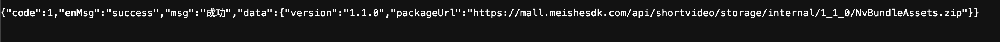
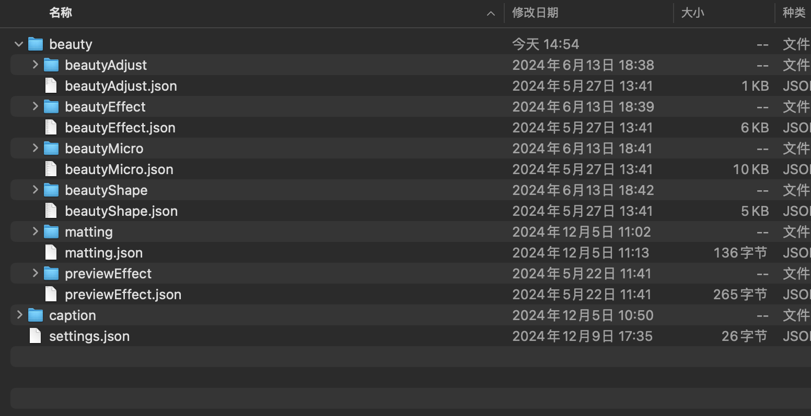
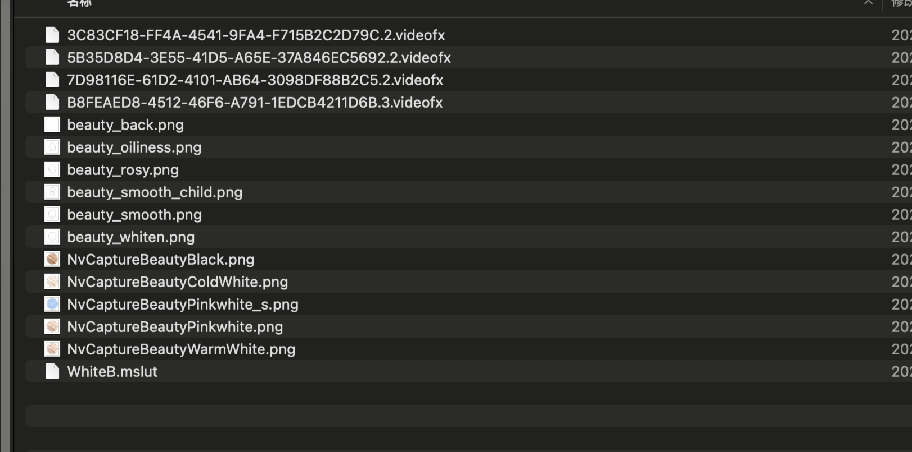
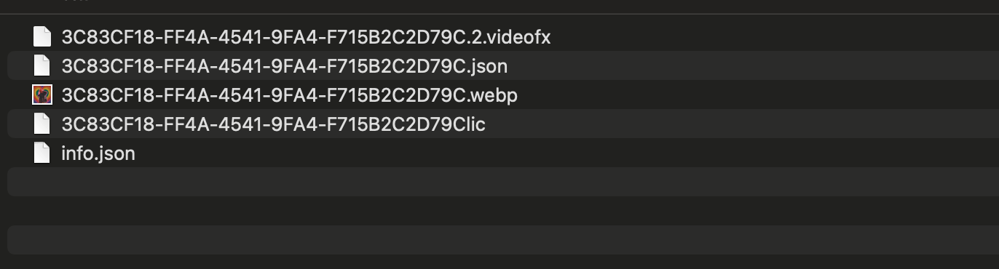
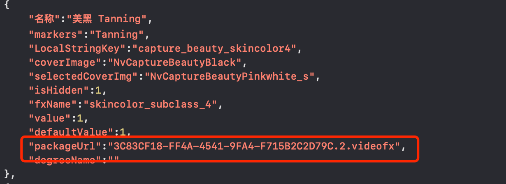
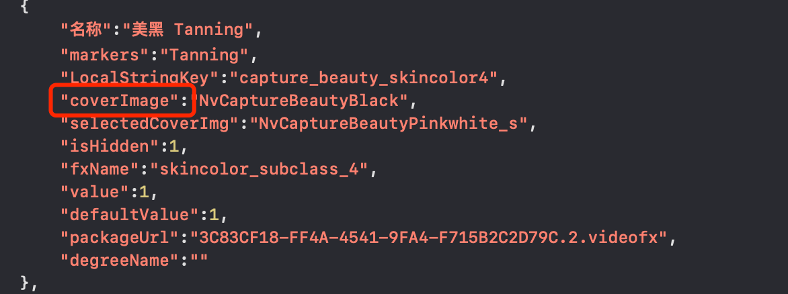
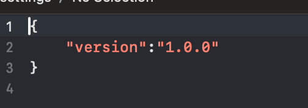
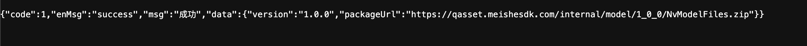
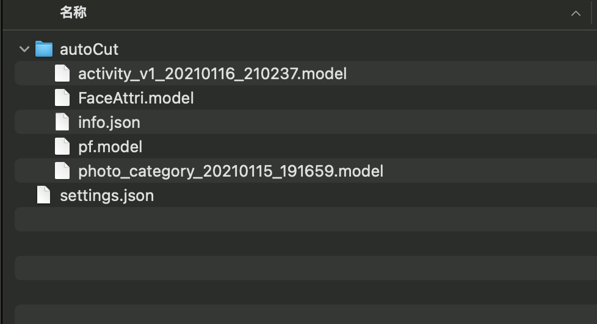

---
html:
    toc: true
print_background: true
---

<!-- MEISHE_AGENT_DOC_ENHANCED: v1 -->

# Preset material configuration

<!-- BEGIN MEISHE_AGENT_QUICK_INDEX -->
> **Agent Quick Index**
> - **Doc ID**: `native-quickstart-doc-en-prefabricatedmaterial-en`
> - **Track**: `shared`
> - **Platforms**: `android, ios`
> - **Tags**: `prefabricated-material, download, server-config, native, flutter, react-native`
> - **Image count**: `9`
> - **Usage**: Locate sections by tags first, then read adjacent steps, config tables, and image notes.
<!-- END MEISHE_AGENT_QUICK_INDEX -->


## Preface
In short video projects, some built-in materials will be used, including beauty functions and subtitle functions.

Please obtain the authorization from Meishe SDK. These materials need to be purchased in the mall first. Please configure the pre-made materials before using the short video project. If you encounter problems in purchasing materials or configuration, please contact the business

```
Warning: The name and format of the folder cannot be modified
```

## Specific operation process

### Step 1
Enter the following address in your browser to get the download address of the latest pre-made material package
https://mall.meishesdk.com/api/shortvideo/materialcenter/beautyAssets/latest

The data returned by the browser contains the latest download address of the preset material package.

> **Image parse:** `path=../assets/image-7.png`, `size=2658x114`, use: step screenshot; inspect near the preceding heading before editing.

Enter the packageUrl field in the browser to download the latest pre-made material package and decompress the compressed package.


> **Image parse:** `path=../assets/image-1.png`, `size=1552x798`, use: step screenshot; inspect near the preceding heading before editing.

Among them, beauty contains beauty-related files.
```

beautyEffect.json：Beauty configuration items
beautyEffect：Beauty configuration item dependency file

beautyShape.json：face shape configuration item
beautyShape：face shape  configuration item dependency file

beautyMicro.json：Micro shaping configuration items
beautyMicro：Micro shaping configuration item dependency file

beautyAdjust.json：Adjust configuration items
beautyAdjust：Adjust configuration item dependency files

previewEffect.json：Preview configuration items
previewEffect：Preview configuration item dependency files

matting.json：Built-in Matting configuration items
matting：Built-in Matting configuration item dependency files
```

captionIt is a file related to subtitles
```
caption.json：Subtitle configuration items
caption：Subtitle configuration item dependency file
```

settings.json is a version control json file

### Step 2
Open the beautyEffect folder

> **Image parse:** `path=../assets/image-2.png`, `size=1622x806`, use: step screenshot; inspect near the preceding heading before editing.

The .videofx file is our filter package. You need to purchase the relevant material package in the material mall and download it. Please consult the business for the purchase and download process. After downloading the purchased material package, you will get a folder like this. You only need to put .videofx and .lic files to the beautyEffect folder. If the uuid and version number of the material package have changed, you need to change the beautyEffect.json file.


> **Image parse:** `path=../assets/image-3.png`, `size=1372x370`, use: step screenshot; inspect near the preceding heading before editing.

For example

3C83CF18-FF4A-4541-9FA4-F715B2C2D79C.2.videofx After downloading the material package

became 3C83CF18-FF4A-4541-9FA4-F715B2C2D79C.4.videofx

The version has changed. You need to modify the configuration items of beautyEffect.json and replace packageUrl with 3C83CF18-FF4A-4541-9FA4-F715B2C2D79C.4.videofx.


> **Image parse:** `path=../assets/image-4.png`, `size=1230x448`, use: step screenshot; inspect near the preceding heading before editing.

.png is the cover icon used and can be replaced by yourself. If you modify the icon name, you need to modify the configuration item of beautyEffect.json and replace the coverImage field.


> **Image parse:** `path=../assets/image-5.png`, `size=1172x438`, use: step screenshot; inspect near the preceding heading before editing.

The .mslut file is a special file required for effects and is not recommended for users to replace.


### Step 3 

Open the beautyShape, beautyMicro, beautyAdjust, caption and other folders and replace the materials inside

Among them, .facemesh, .warp, and .animatedsticker are all material packages of Meishou. They all need to be purchased and downloaded. Please refer to the process.[step2](#step2)

### Step 4

After the replacement is completed, modify settings.json, increase the version number once, and upgrade 1.0.0 to 1.0.1


> **Image parse:** `path=../assets/image-6.png`, `size=504x178`, use: step screenshot; inspect near the preceding heading before editing.

### Step 5

After all modifications are completed, compress the NvBundleAssets folder and re-upload it. You can contact business assistance.

## json field meaning

Lists the fields that can be modified. Please modify them as needed.

```
coverImage：unchecked icon
selectedCoverImg：check icon
value：The current value
defaultValue：default value
packageUrl：Material packages used or file
```

# Model configuration
## Explanation
In short video projects, some built-in models are used
## Specific operation process

### Step 1
Enter the following address in your browser to get the download address of the latest pre-made material package
https://mall.meishesdk.com/api/shortvideo/test/materialcenter/beautyAssets/latest?assetType=model

The data returned by the browser contains the latest download address of the preset material package.

> **Image parse:** `path=../assets/image-8.png`, `size=2468x144`, use: step screenshot; inspect near the preceding heading before editing.

Enter the packageUrl field in the browser to download the latest pre-made material package and decompress the compressed package.


> **Image parse:** `path=../assets/image-9.png`, `size=978x532`, use: step screenshot; inspect near the preceding heading before editing.

### Step 2
Replace your model file as needed. After the replacement is completed, modify settings.json and increase the version number once, upgrading from 1.0.0 to 1.0.1

### Step 3
After all modifications are completed, compress the NvModelFiles folder and re-upload it. You can contact business assistance.

<!-- BEGIN MEISHE_AGENT_IMAGE_INDEX -->
## Agent Image Index

| Image | Size | Exists | Inferred use |
| --- | --- | --- | --- |
| `../assets/image-7.png` | `2658x114` | `true` | step screenshot; inspect near the preceding heading before editing |
| `../assets/image-1.png` | `1552x798` | `true` | step screenshot; inspect near the preceding heading before editing |
| `../assets/image-2.png` | `1622x806` | `true` | step screenshot; inspect near the preceding heading before editing |
| `../assets/image-3.png` | `1372x370` | `true` | step screenshot; inspect near the preceding heading before editing |
| `../assets/image-4.png` | `1230x448` | `true` | step screenshot; inspect near the preceding heading before editing |
| `../assets/image-5.png` | `1172x438` | `true` | step screenshot; inspect near the preceding heading before editing |
| `../assets/image-6.png` | `504x178` | `true` | step screenshot; inspect near the preceding heading before editing |
| `../assets/image-8.png` | `2468x144` | `true` | step screenshot; inspect near the preceding heading before editing |
| `../assets/image-9.png` | `978x532` | `true` | step screenshot; inspect near the preceding heading before editing |
<!-- END MEISHE_AGENT_IMAGE_INDEX -->
