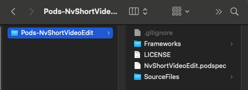

<!-- MEISHE_AGENT_DOC_ENHANCED: v1 -->
# Meishe short video module access guide

<!-- BEGIN MEISHE_AGENT_QUICK_INDEX -->
> **Agent Quick Index**
> - **Doc ID**: `native-quickstart-doc-en-quickstart-en`
> - **Track**: `native`
> - **Platforms**: `ios`
> - **Tags**: `quickstart, integration, native-ios, cocoapods, podfile, info.plist, permission, license, server-config`
> - **Image count**: `1`
> - **Usage**: Locate sections by tags first, then read adjacent steps, config tables, and image notes.
<!-- END MEISHE_AGENT_QUICK_INDEX -->


## General Integration Process

<!-- BEGIN MEISHE_AGENT_SECTION_HINT -->
> **Agent section hint:** tags `integration`. Check steps, config values, paths, and permission requirements before editing.
<!-- END MEISHE_AGENT_SECTION_HINT -->

* First, follow the current documentation for integration.
* Contact the sales department to request SDK authorization.
* By default, ShortVideo uses Meishe's own server. After integration, you will be required to migrate the server to your own server. Contact the sales department and we will arrange for a team to deploy the server for you.
* **If you need to modify the current app's display, refer to the UI configuration or module configuration in the current documentation. (If you don't need to modify the UI, ignore this step.)**

## Development environment requirements

* iOS 12.0 and above
* Swift 5 
* CocoaPods

> ⚠️ **Note:**  This feature must be run on a physical device, as it is currently not supported on the simulator.

## Upgrade short video notes
### Version 2.0.0 Updates:
* Fixed some known issues
### Version 1.5.1 Updates:
* Fixed some known issues
### Version 1.5.0 Updates:
* **This release involves significant updates; therefore, regression testing is absolutely essential prior to deployment—particularly regarding changes to configuration settings.**
### Version 1.4.0 Updates:
* The shortvideo internal code has been almost entirely converted to Swift, with some changes in the use of native code. The key focus is on the changes to the Swift interfaces exposed by shortvideo and whether callbacks are triggered correctly.
* **The NvStreamingSdkCore.xcframework has been upgraded to version 3.15.3. If you upgraded from a version below 1.4.0, you need to contact your sales team to update the SDK license.**
* The AutoCut video creation feature has been completely upgraded. You can now contact our server-side development team in a group chat to assist with upgrading the server-side interface. This upgrade is only available for iOS; Android is not yet supported. Therefore, to use the AutoCut video creation feature, you must contact our server-side team for assistance. Please feel free to contact us with any questions.
  ```
  private func setWebConfig() {
        let moduleManager = NvModuleManager.sharedInstance()
        let request = moduleManager.netDelegate!
        request.dependencyDelegate = dependencyDelegate
        request.setHost("https://mall.meishesdk.com/api/shortvideo/v1")
        request.assetAutoCutUrl = "https://creative.meishesdk.com/api/app/aivideo/asset/all/1"
        
        if isCurrentLanguageNoChinese() {
            request.isAbroad = 1
        }
        _ = moduleManager.prepareDownloadFolders()
        networkState()
    }
  ```
* **For server updates, please contact our server team.**
### Version 1.3.0 Updates:
* **Version 1.3.0 relocated the Publish and Save buttons on the right side of the editor to the bottom,The button UI configuration key remains unchanged, and added the ability to report errors for multiple images.The short video platform has converted some of its code to Swift, resulting in minor changes to the use of native code，Pay close attention to whether the callback of shortvideo is triggered correctly. Xcode will provide automatic suggestions, and you can make the necessary modifications accordingly. There are no changes to Flutter and React Native.**
### 1.2.9 Version upgrade:
* **Version 1.2.9 adds the function of exporting videos and pictures with watermarks. If the user configures a watermark, the video and cover will be watermarked when exported.**
### 1.2.8 Version upgrade：
In version 1.2.7, you need to download resources before entering shooting, editing, and co-shooting. The new version will not block the entry into shooting, editing, and co-shooting, and will silently download in the background when entering. It also provides an interface for users to actively call it. If the user does not actively call shortvideo, it will be called by default.
```Objective-C
- (void)downloadPrefabricatedMaterialCompletion:(void (^_Nullable)(BOOL isFinish))completionHandler;
```
### 1.2.7 Version upgrade：
* **Native projects directly replace Frameworks libraries.**
In version 1.2.7, the original void value is changed to BOOL value in the block parameter of `startCaptureWithPresentViewController` `startDualCaptureWithPresentViewController` `startEditWithPresentViewController`. Please note that if your block passes nil, there will be no change after the upgrade. If you pass non-null, please pay attention to the following block parameters.
```Objective-C
- (void)startCaptureWithPresentViewController:(UIViewController *)viewController
                                       config:(NvVideoConfig * _Nullable)config
                                        music:(NvCaptionMusicInfo * _Nullable)music
                                         with:(void(^)(BOOL isFinish))complatetionHandler;
- (void)startDualCaptureWithPresentViewController:(UIViewController *)viewController
                                           config:(NvVideoConfig * _Nullable)config
                                             with:(void(^)(BOOL isFinish))complatetionHandler;
- (void)startEditWithPresentViewController:(UIViewController *)viewController
                                    config:(NvVideoConfig * _Nullable)config
                                      with:(void(^)(BOOL isFinish))complatetionHandler;
```

## Support media formats

For details, see: [Meishes sdk product overview](https://www.meishesdk.com/ios/doc_en/html/content/Introduction_8md.html)

## Short video module integration

<!-- BEGIN MEISHE_AGENT_SECTION_HINT -->
> **Agent section hint:** tags `integration`. Check steps, config values, paths, and permission requirements before editing.
<!-- END MEISHE_AGENT_SECTION_HINT -->


After the short video module is downloaded and decompressed, use the short video module as the CocoaPods local private library. The file directories are as follows:



> **Image parse:** `path=../assets/image.png`, `size=494x180`, use: step screenshot; inspect near the preceding heading before editing.

1. **Create the **Podfile** file**
   Enter the following command line to enter the project path, the project path will appear a **Podfile** file.
   
   ```
   pod init
   ```

2. **Edit the **Podfile** file to add the short video module dependency**
   
   ```
   platform :ios, '12.0'
   source 'https://github.com/CocoaPods/Specs.git'
   use_frameworks!
   
   target 'App' do
     # NvShortVideoCore
     pod 'NvShortVideoEdit',    :path => '../Pods-NvShortVideoEdit'
   end
   ```

3. **Installation dependency**
   
   ```
   pod install
   ```

4. **Copy the demo files.**
Don't worry if you're a flutter user or a reactnative user. If you're using a native project, you'll need to copy the two files in the demo, Config.swift and NvHttpRequestDelegate.swift, into your project. Config.swift configures the network interface URL; simply change the **host** to your own server. NvHttpRequestDelegate is used to load third-party libraries.
After that, configure the URL in your code. Finally,Call setWebConfig() in the current controller, click the button to enter the short video capture and editing page.
```swift
var videoConfig: NvVideoConfig?
let dependencyDelegate = NvHttpRequestDelegate()
override func viewDidLoad() {
    super.viewDidLoad()
    // Do any additional setup after loading the view.
    setupModuleManager()
    
    //web config
    setWebConfig()
    test()
}
private func setWebConfig() {
    let moduleManager = NvModuleManager.sharedInstance()
    // 这里如果你有自己实现HttpRequest类，那么这里你可以创建一个HttpRequest对象实例赋值给moduleManager.netDelegate，并设置好url
    // Here if you have your own implementation HttpRequest class,
    // so here you can create an HttpRequest object instance assigned to moduleManager.net Delegate, and set up the url
    let request = moduleManager.netDelegate as! NvHttpRequest
    request.dependencyDelegate = dependencyDelegate
    request.assetRequestUrl = NV_ASSET_REQUEST_URL
    request.assetCategoryUrl = NV_ASSET_CATEGORY_URL
    request.assetMusiciansUrl = NV_ASSET_MUSICIANS_URL
    request.assetFontUrl = NV_ASSET_FONT_URL
    request.assetDownloadUrl = NV_ASSET_DOWNLOAD_URL
    request.assetPrefabricatedUrl = NV_ASSET_PREFABRICATED_URL
    request.assetAutoCutUrl = NV_ASSET_AUTOCUT_URL
    request.assetTagUrl = NV_ASSET_TAG_URL
    
    request.clientId = NV_ClientId
    request.clientSecret = NV_ClientSecret
    request.assemblyId = NV_AssemblyId
    
    if isCurrentLanguageNoChinese() {
        request.isAbroad = 1
    }
    moduleManager.prepareDownloadFolders()
    networkState()
}

func isCurrentLanguageNoChinese() -> Bool {
    guard let language = Locale.preferredLanguages.first else {
        return false
    }
    return !language.hasPrefix("zh")
}

func networkState() {
    let monitor = NWPathMonitor()
    let queue = DispatchQueue(label: "NetworkMonitor")
    monitor.pathUpdateHandler = { path in
        if path.status == .satisfied {
            // 网络可用
            DispatchQueue.main.async {
                let moduleManager = NvModuleManager.sharedInstance()
                moduleManager.preloadedResource()
            }
            monitor.cancel()
        } else {
            // 网络不可用
            print("Network not reachable")
        }
    }
    monitor.start(queue: queue)
}
```

## System authorization

App needs to add the following permissions in **Info.plist**, otherwise it will not be able to use the short video module.


```xml
<key>NSCameraUsageDescription</key>
<string>AppYour consent is required to access the camera</string>
<key>NSMicrophoneUsageDescription</key>
<string>AppYour consent is required to access the microphone</string>
<key>NSPhotoLibraryUsageDescription</key>
<string>AppYour consent is required to access the album</string>
<key>NSAppleMusicUsageDescription</key>
<string>AppYour consent is required to access music</string>
```

## Meishe SDK authorization

Meishe SDK authorization method:

```objective-c
#import <NvStreamingSdkCore/NvsStreamingContext.h>

@interface AppDelegate ()
@end

@implementation AppDelegate

- (BOOL)application:(UIApplication *)application didFinishLaunchingWithOptions:(NSDictionary *)launchOptions {
    NSString *licPath = [[NSBundle mainBundle] pathForResource:@"meicam_licence" ofType:@"lic"];
    BOOL ret = [NvsStreamingContext verifySdkLicenseFile:licPath];
    if (!ret) {
        NSLog(@"verifySdkLicenseFile faild");
    }

    return YES;
}
@end
```

After registering as a user on [Meishe‘s official website](https://en.meishesdk.com/), create an application and configure the App package name. After a Meishe business colleague activates the authorization, you can download the authorization file in the application information.


> The SDK authorization is bound to the Bundle Idenfity of the App. When it is not authorized, all functions of the SDK can be used without checking the authorization, and the drawn picture will have the MEISHE watermark.


## Network interface configuration

<!-- BEGIN MEISHE_AGENT_SECTION_HINT -->
> **Agent section hint:** tags `server-config`. Check steps, config values, paths, and permission requirements before editing.
<!-- END MEISHE_AGENT_SECTION_HINT -->


The filters, stickers, music and other files used in the short video module are all obtained through the network interface. The server needs to implement the corresponding interface according to the interface document.

Configure the server address and public parameters in the App project.

```Swift
// refer to the example
private func setWebConfig() {}
```
## Preset material

<!-- BEGIN MEISHE_AGENT_SECTION_HINT -->
> **Agent section hint:** tags `prefabricated-material`. Check steps, config values, paths, and permission requirements before editing.
<!-- END MEISHE_AGENT_SECTION_HINT -->


The material packages that the short video module relies on can be selected as needed. For details of preset materials, see: [Short video module preset materials](PrefabricatedMaterial_en.html)
Download preset materials. If you call this interface, shortvideo will not call it repeatedly when entering. If you do not call it, shortvideo will default to background calling when entering.
```Objective-C
/*! \if ENGLISH
 *
 *  \brief Download material
 *  \param completionHandler Completion callback
 *  \else
 *  \endif
 *  */
- (void)downloadPrefabricatedMaterialCompletion:(void (^_Nullable)(BOOL isFinish))completionHandler;
```

## Main methods of short video module

The module main methods are defined in the [**NvModuleManager**.h](./interface_nv_module_manager.html) file.
Example call:

```swift
let moduleManager = NvModuleManager.sharedInstance()
moduleManager.downloadPrefabricatedMaterialCompletion(nil)
guard let navigationController = navigationController else { return }
moduleManager.startCapture(
    withPresent: navigationController,
    config: videoConfig,
    music: nil
) { isFinish in
}
```

```objective-c
// 引入头文件
#import <NvShortVideoCore/NvShortVideoCore.h>

- (IBAction)sendertapCapture:(UIButton*)bt {
    bt.enabled = NO;
    NvVideoConfig *config = [[NvVideoConfig alloc] init];
    NvModuleManager* moduleManager = [NvModuleManager sharedInstance];
    [moduleManager startCaptureWithPresentViewController:self.navigationController config:config music:nil with:^{
        bt.enabled = YES;
    }];
}
```

### Video recording

```objective-c
 /*! \if ENGLISH
 *
 *  \brief Shooting entrance
 *  \param viewController Current viewController
 *  \param config Configuration item
 *  \param music The default is nil，If you need to shoot with music, you need to pass an audio object, and the path of the audio must be local and has been downloaded
 *  \param complatetionHandler
 *  \else
 *
 *  \brief 拍摄入口
 *  \param viewController 当前控制器
 *  \param config 配置项
 *  \param music 默认是nil，如果拍摄时需要带音乐拍摄，需要传递一个音频对象，音频的路径必须是本地的，已经下载的路径
 *  \param complatetionHandler
 *  \endif
 */
- (void)startCaptureWithPresentViewController:(UIViewController *)viewController
                                       config:(NvVideoConfig * _Nullable)config
                                        music:(NvCaptionMusicInfo * _Nullable)music
                                         with:(void(^)(void))complatetionHandler;
```

### Picture in Picture

```objective-c
/*! \if ENGLISH
 *
 *  \brief PIP entrance By default, the album is opened, and a material from the album is taken into the beat
 *  \param viewController Current viewController
 *  \param config Configuration item
 *  \param complatetionHandler
 *  \else
 *
 *  \brief 合拍入口，默认打开相册，从相册取一个素材进入合拍
 *  \param viewController 当前控制器
 *  \param config 配置项
 *  \param complatetionHandler
 *  \endif
 */
- (void)startDualCaptureWithPresentViewController:(UIViewController *)viewController
                                           config:(NvVideoConfig * _Nullable)config
                                             with:(void(^)(void))complatetionHandler;

/*! \if ENGLISH
 *
 *  \brief PIP entrance
 *  \param viewController Current viewController
 *  \param config Configuration item
 *  \param videoPath The video path to be filmed must be a local path
 *  \param complatetionHandler
 *  \else
 *
 *  \brief 合拍入口
 *  \param viewController 当前控制器
 *  \param config 配置项
 *  \param videoPath 准备合拍的视频路径，必须是本地路径
 *  \param complatetionHandler
 *  \endif
 */
- (void)startDualCaptureWithPresentViewController:(UIViewController *)viewController
                                           config:(NvVideoConfig * _Nullable)config
                                        videoPath:(NSString *)videoPath
                                             with:(void(^)(void))complatetionHandler;
```

### Video editing

<!-- BEGIN MEISHE_AGENT_SECTION_HINT -->
> **Agent section hint:** tags `function-config`. Check steps, config values, paths, and permission requirements before editing.
<!-- END MEISHE_AGENT_SECTION_HINT -->


```objective-c
/*! \if ENGLISH
 *
 *  \brief Edit entrance
 *  \param viewController Current viewController
 *  \param config Configuration item
 *  \param complatetionHandler
 *  \else
 *
 *  \brief 编辑入口
 *  \param viewController 当前控制器
 *  \param config 配置项
 *  \param complatetionHandler
 *  \endif
 */
- (void)startEditWithPresentViewController:(UIViewController *)viewController
                                    config:(NvVideoConfig * _Nullable)config
                                      with:(void(^)(void))complatetionHandler;
```

### Video editing complete callback

<!-- BEGIN MEISHE_AGENT_SECTION_HINT -->
> **Agent section hint:** tags `function-config`. Check steps, config values, paths, and permission requirements before editing.
<!-- END MEISHE_AGENT_SECTION_HINT -->


```objective-c
/*!
 * \if ENGLISH
 *
 *  \brief Edit complete, ready to enter publish callback
 *  \else
 *
 *  \brief 编辑完成，准备进入发布回调
 *  \endif
 */
@protocol NvModuleManagerDelegate <NSObject>

/*!
 * \if ENGLISH
 *
 *  \brief Edit complete, jump release callback
 *  @param taskId  Edit the event id used to exit the module
 *  @param coverImagePath cover
 *  @param hasDraft Whether there is a draft button
 *  @param draftInfo The title displayed on the publish page
 *  @param videoEditNavigationController Current nav controller
 *  \else
 *
 *  \brief 编辑完成，跳转发布回调
 *  @param taskId 编辑事件id，用于退出模块
 *  @param coverImagePath 封面图
 *  @param hasDraft 是否有草稿按钮
 *  @param draftInfo 发布页显示的标题
 *  @param videoEditNavigationController 当前nav控制器
 *  \endif
 *  \sa exitVideoEdit:
 */
- (void)publishWithTaskId:(NSString *)taskId
           coverImagePath:(NSString *)coverImagePath
                 hasDraft:(BOOL)hasDraft
                draftInfo:(NSString *_Nullable)draftInfo
videoEditNavigationController:(UINavigationController *)videoEditNavigationController;

@end
```

### Select cover

```objective-c
/*! \if ENGLISH
 *
 *  \brief Save the cover image to the album
 *  \param coverPath Current cover map path
 *  \param completionHandler
 *  \warning Publish page Save picture button, click after the call
 *  \else
 *
 *  \brief 保存封面图到相册
 *  \param coverPath 当前封面图路径
 *  \param completionHandler
 *  \warning 发布页保存图片按钮，点击之后调用
 *  \endif
 */
- (void)saveCover:(NSString *)coverPath with:(nullable void(^)(BOOL success))completionHandler;
```

### Save draft

<!-- BEGIN MEISHE_AGENT_SECTION_HINT -->
> **Agent section hint:** tags `function-config`. Check steps, config values, paths, and permission requirements before editing.
<!-- END MEISHE_AGENT_SECTION_HINT -->


```objective-c
/*! \if ENGLISH
 *
 *  \brief Save draft
 *  \param infoString The text of the currently saved publication page
 *  \warning Publish page Save draft button, called after clicking
 *  \else
 *
 *  \brief 保存草稿
 *  \param infoString 当前保存的发布页文本
 *  \warning 发布页保存草稿按钮，点击之后调用
 *  \endif
 */
- (BOOL)saveCurrentDraftWithDraftInfo:(NSString *_Nullable)infoString;
```

### Synthetic video

```objective-c
/*! \if ENGLISH
 *
 *  \brief Start exporting video
 *  \param configure Default is nil, no need to pass
 *  \warning Publish page Save video button, click after the call
 *  \else
 *
 *  \brief 开始导出视频
 *  \param configure 默认是nil，不需要传
 *  \warning 发布页保存视频按钮，点击之后调用
 *  \endif
 */
- (BOOL)compileCurrentTimeline:(NSDictionary *_Nullable)configure;
```

### Video synthesis callback

```objective-c
/*! \if ENGLISH
 *
 *  \brief sdk video export callback
 *  \else
 *
 *  \brief sdk视频导出回调
 *  \endif
 */
@protocol NvModuleManagerCompileStateDelegate <NSObject>

/*! \if ENGLISH
 *
 *  \brief compile video progress callback
 *  \param progress  the current progress
 *  \else
 *
 *  \brief 合成视频进度回调
 *  \param progress 当前的进度
 *  \endif
 */
- (void)didCompileFloatProgress:(float)progress;

/*! \if ENGLISH
 *
 *  \brief The resultant video completes the callback
 *  \param outputPath Video output file path
 *  \param error error
 *  \else
 *
 *  \brief 合成视频完成回调
 *  \param outputPath 视频输出的文件路径
 *  \param error 错误信息
 *  \endif
 */
- (void)didCompileCompleted:(NSString *_Nullable)outputPath error:(NSError *_Nullable)error;

@end
```

### Save video file

```objective-c
/*! \if ENGLISH
 *
 *  \brief Save the video to the album
 *  \param coverPath Current video path
 *  \param completionHandler
 *  \else
 *
 *  \brief 保存视频到相册
 *  \param coverPath 当前视频路径
 *  \param completionHandler
 *  \endif
 */
- (void)saveVideo:(NSString *)videoPath with:(nullable void(^)(BOOL success))completionHandler;
```

### Save cover image

```objective-c
/*! \if ENGLISH
 *
 *  \brief Save the cover image to the album
 *  \param coverPath Current cover map path
 *  \param completionHandler
 *  \warning Publish page Save picture button, click after the call
 *  \else
 *
 *  \brief 保存封面图到相册
 *  \param coverPath 当前封面图路径
 *  \param completionHandler
 *  \warning 发布页保存图片按钮，点击之后调用
 *  \endif
 */
- (void)saveCover:(NSString *)coverPath with:(nullable void(^)(BOOL success))completionHandler;
```

### Get a list of all currently selected materials

<!-- BEGIN MEISHE_AGENT_SECTION_HINT -->
> **Agent section hint:** tags `prefabricated-material`. Check steps, config values, paths, and permission requirements before editing.
<!-- END MEISHE_AGENT_SECTION_HINT -->

```objective-c
/*! \if ENGLISH
 *
 *  \brief Get a list of all currently selected materials
 *  \else
 *
 *  \brief 获取当前所选所有素材列表
 *  \endif
 */
- (NSMutableArray *)getAVFileInfoArray;
```

### Get material information

<!-- BEGIN MEISHE_AGENT_SECTION_HINT -->
> **Agent section hint:** tags `prefabricated-material`. Check steps, config values, paths, and permission requirements before editing.
<!-- END MEISHE_AGENT_SECTION_HINT -->

```objective-c
/*! \if ENGLISH
 *
 *  \brief Get material information
 *  \param path material path
 *  \else
 *
 *  \brief 获取素材信息
 *  \param path 素材路径
 *  \endif
 */
- (NvsAVFileInfo*)getAVFileInfo:(NSString *)path;
```

### Exit short video module

Call it when the video publishing page exits

```objective-c
/*! \if ENGLISH
 *
 *  \brief Exit the entire publisher call
 *  \param taskId Returned by the edit completion callback
 *  \warning This method will clean up the current draft and SDK-held resources, please call after completely exiting the editing and publishing process
 *  \else
 *
 *  \brief 退出整个发布器调用
 *  \param taskId 由编辑完成回调中返回
 *  \warning 该方法会清理当前草稿以及sdk持有资源，请在完全退出编辑发布流程之后，调用
 *  \endif
 */
- (BOOL)exitVideoEdit:(NSString *)taskId;
```

### Get draft list

<!-- BEGIN MEISHE_AGENT_SECTION_HINT -->
> **Agent section hint:** tags `function-config`. Check steps, config values, paths, and permission requirements before editing.
<!-- END MEISHE_AGENT_SECTION_HINT -->


The method is defined in [NvDraftModel.h](./interface_nv_draft_manager.html)

```objective-c
/*! \if ENGLISH
 *
 *  \brief Gets all drafts saved in the sandbox
 *  \return draft list
 *  \else
 *
 *  \brief 获取沙盒中保存的所有草稿
 *  \return 草稿列表
 *  \endif
*/
+ (NSMutableArray<NvDraftModel *> *)getUserDraftFileArray;
```

### Delete draft

<!-- BEGIN MEISHE_AGENT_SECTION_HINT -->
> **Agent section hint:** tags `function-config`. Check steps, config values, paths, and permission requirements before editing.
<!-- END MEISHE_AGENT_SECTION_HINT -->


The method is defined in [NvDraftModel.h](./interface_nv_draft_manager.html)

```objective-c
/*! \if ENGLISH
 *
 *  \brief Delete a draft file
 *  \param model draft
 *  \else
 *
 *  \brief 删除某个草稿文件
 *  \param model draft
 *  \endif
*/
+ (void)deleteDraftFile:(NvDraftModel *)model;
```

### Open draft

<!-- BEGIN MEISHE_AGENT_SECTION_HINT -->
> **Agent section hint:** tags `function-config`. Check steps, config values, paths, and permission requirements before editing.
<!-- END MEISHE_AGENT_SECTION_HINT -->


The method is defined in [**NvModuleManager**.h](./interface_nv_module_manager.html)

```objective-c
/*! \if ENGLISH
 *
 *  \brief Enter the editing portal through draft data recovery
 *  \param draft Current draft object
 *  \param viewController Current viewController
 *  \param config Configuration item
 *  \else
 *
 *  \brief 通过草稿数据恢复，进入编辑入口
 *  \param draft 当前草稿对象
 *  \param viewController 当前控制器
 *  \param config 配置项
 *  \endif
 */
- (void)reeditDraft:(NvDraftModel *)draft presentViewController:(UIViewController *)viewController
             config:(NvVideoConfig * _Nullable)config;
```


## Module settings

The short video module setting class **NvVideoConfig** includes function module settings and UI customization. For details, see: [Short video function module settings](functionConfiguration_en.html)、[Short video UI module settings](UIConfiguration_en.html)

<!-- BEGIN MEISHE_AGENT_IMAGE_INDEX -->
## Agent Image Index

| Image | Size | Exists | Inferred use |
| --- | --- | --- | --- |
| `../assets/image.png` | `494x180` | `true` | step screenshot; inspect near the preceding heading before editing |
<!-- END MEISHE_AGENT_IMAGE_INDEX -->
